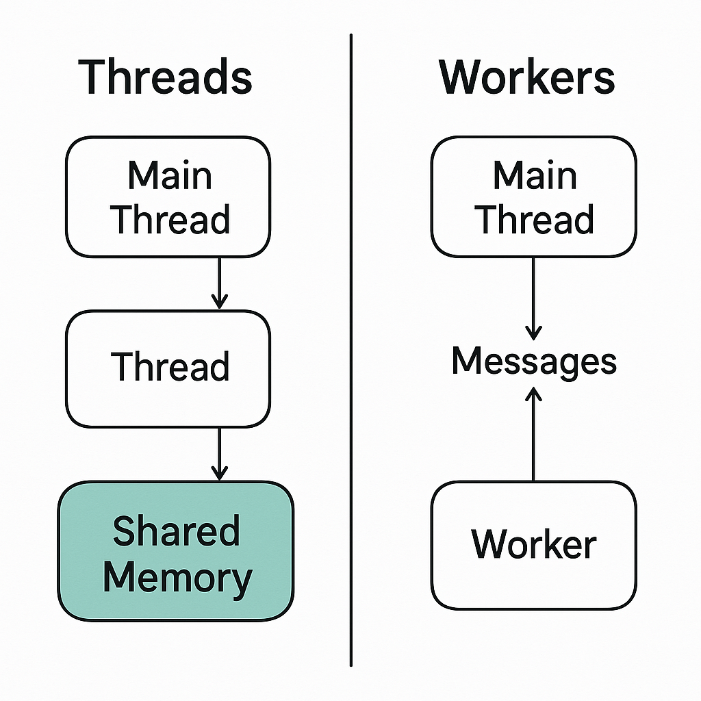

# Асинхронность в программировании

Прежде всего давайте определимся с понятиями синхронного и асинхронного кода:

**Синхронный код** — *это код, в котором все инструкции выполняются строго последовательно, строка за строкой, и где переход к последующей строке кода возможен только в том случае, если полностью выполнена предыдущая.* 

**Асинхронный код** - *это код, в котором при выполнении потенциально длительной задачу, есть возможность реагировать на другие события во время выполнения этой задачи, вместо того, чтобы ждать, пока эта задача завершится.*

Асинхронный код предполагает параллельный или квази-параллельный запуск нескольких программ или частей одной и той же программы.

**Concurrency** - дословно параллелизм (или, точнее, квази-параллелизм) - возможность запустить выполнение нескольких независимых участков кода внутри одной программы.   
Это не означает одновременность, а лишь то, что задачи могут быть приостановлены и возобновлены, управляя их выполнением без блокировки всей программы.
Распространённый ошибочный перевод этого слова - "конкуренция", бессмысленный и ошибочный одновременно.  
Во-первых, параллельный запуск - это не "конкуренция", а сотрудничество для достижения асинхронности.  
А, во-вторых, конкуренция - это *competition*, а не *concurrency*.

Подробнее здесь: https://it4each.com/blog/threading-multiprocessing-i-asyncio-v-python/


## Способы достижения асинхронности

Можно выделить три основных способа организации асинхронного кода:
  - Threading (потоки)
  - Multiprocessing (мультипроцессы)
  - Coroutines and Event Loop (корутин, управляемые циклом)


Подробнее здесь: https://it4each.com/blog/threading-multiprocessing-i-asyncio-v-python-chast-2/


## 1. Threading (Потоки) в JavaScript:


В JavaScript можно организовать параллельное выполнение с помощью различных подходов, связанных с потоками (threading) и awaitable операциями. Они предоставляют способы работы с многозадачностью, асинхронностью и параллельным выполнением. Давайте разделим их на две категории:

В JavaScript традиционные потоки, как в других языках (например, Python или Java), не существуют.  
Вместо этого используются `Web Workers` и другие механизмы для многозадачности.


<p align="center">
  
</p>

<!--  -->


Основные способы работы с потоками (`threading`):

### `Web Workers` 

`Web Workers` позволяют запускать скрипты в отдельных потоках, обеспечивая параллельное выполнение, не блокируя основной поток выполнения (главный поток).

#### Пример:

```
// Основной поток
const worker = new Worker('worker.js');
worker.onmessage = function(event) {
  console.log(event.data);  // Получение данных из worker
};
worker.postMessage('Hello from main thread');  // Отправка сообщения в worker
```

В worker.js:

```
onmessage = function(event) {
  console.log('Message received from main thread: ', event.data);
  postMessage('Hello from worker');
};
```

#### Важные ограничения Web Workers`:

- `Web Workers` не могут напрямую взаимодействовать с DOM, и их работа ограничена только обработкой данных.
- Важно помнить, что JavaScript использует однопоточную модель исполнения с событийным циклом в основном потоке, а Web Workers позволяют только ограниченную параллельность через отдельные потоки.


#### Различие с потоками в Python

| **Язык/Платформа**              | **Python (threading)**                | **JavaScript (Web Workers)**           |
|---------------------------------|--------------------------------------|---------------------------------------|
| **Параллельность**              | Ограничена GIL                       | В браузерах нет реального параллелизма (потоки), в Node.js — да (реальный параллелизм) |
| **Общая память**                | Да                                   | Нет, только через сообщения         |
| **Простой доступ к I/O**        | Да (включая чтение/запись файлов, работу с сетью, доступ к базам данных) | Да (включая чтение/запись файлов, работу с сетью, доступ к базам данных) |
| **Для CPU-задач**               | Неэффективно из-за GIL              | Эффективно (но требует явного управления) |
| **Модель выполнения**           | Многопоточная                        | Однопоточная с возможностью создания воркеров |
| **Подходит для UI**             | Нет (обычно используется в бэкенде)  | Да (в браузере + Web Workers)        |
| **Реальный параллелизм**        | Нет (ограничен GIL)                 | В Node.js — да (реальный параллелизм), в браузерах — нет (потоки) |


### Shared Workers:

Shared Workers — это расширенная версия Web Workers, позволяющая нескольким вкладкам или окнам использовать один общий worker.

#### Пример:

```
// Основной поток

const worker = new SharedWorker('sharedWorker.js');
worker.port.onmessage = function(event) {
  console.log(event.data);
};
worker.port.start();
worker.port.postMessage('Hello from main thread');

// В sharedWorker.js:

onconnect = function(event) {
  const port = event.ports[0];
  port.onmessage = function(event) {
    port.postMessage('Hello from shared worker');
  };
};
```

### API Atomics (для синхронизации между потоками)

В JavaScript можно использовать `API Atomics` для синхронизации между `Web Workers` и основным потоком, например, для работы с разделяемыми памятью.

#### Пример:

```
const sharedBuffer = new SharedArrayBuffer(1024);
const uint8 = new Uint8Array(sharedBuffer);
const worker = new Worker('worker.js');

worker.onmessage = function(event) {
  console.log(uint8[0]); // Чтение данных
};

worker.postMessage(sharedBuffer);
```


## 2. Awaitable операции (Coroutines) в JavaScript:

В JavaScript есть несколько способов работать с awaitable операциями, что позволяет приостанавливать выполнение и ожидать результата. Это часто используется для работы с асинхронными операциями.
Основные способы работы с awaitable операциями:

### Promises: 
Основной способ работы с асинхронностью в JavaScript.  
Это объект, представляющий результат асинхронной операции, который ещё не завершён, но будет завершён в будущем.

#### Пример:
```
function asyncOperation() {
  return new Promise((resolve, reject) => {
    setTimeout(() => resolve('Operation complete'), 1000);
  });
}

asyncOperation().then(result => {
  console.log(result);  // "Operation complete"
});
```

### Async/Await
Это синтаксический сахар для работы с Promises.  
Позволяет писать асинхронный код, как синхронный, при этом не блокируя выполнение.

#### Пример:
```
async function example() {
  const result = await asyncOperation();
  console.log(result);  // "Operation complete"
}

example();
```

### `setTimeout` и `setInterval`

Эти функции позволяют отложить выполнение операции на некоторое время.  
Они не являются `true awaitable`, но часто используются для создания асинхронных задержек в коде.

#### Пример:
```
setTimeout(() => {
  console.log('Delayed operation');
}, 1000);
```

### `requestAnimationFrame`

Это ещё одна форма асинхронности, используемая для работы с анимациями.  
Она позволяет запланировать выполнение функции в следующем цикле рендеринга браузера.

#### Пример:
```
function animate() {
  console.log('Animation frame');
  requestAnimationFrame(animate);
}

requestAnimationFrame(animate);
```

### `fetch` 

Современный способ работы с HTTP-запросами в браузере (грубо говоря, сильно улучшенный AJAX)  
Возвращает `Promise`, который можно использовать с `await`.

В отличии от `AJAX`, `fetch` может:
- поддерживать современные стандарты, такие как `Promise` и `async/await`
- поддерживать JSON по умолчанию (в `AJAX` необходима ручная обработка JSON).

#### Пример:
```
async function fetchData() {
  const response = await fetch('https://api.example.com/data');
  const data = await response.json();
  console.log(data);
}

fetchData();
```

### Event Listeners (с асинхронными операциями)

Обработчики событий могут также быть асинхронными.  
Когда они срабатывают, они могут выполнять асинхронные действия с использованием `await`.

#### Пример:
```
document.getElementById('button').addEventListener('click', async () => {
  const result = await asyncOperation();
  console.log(result);
});
```

## Итоговая сводка по категориям

# Сводка по категориям

| **Технология**              | **Категория**        | **Описание**                                                                                                                                                 |
|-----------------------------|----------------------|-------------------------------------------------------------------------------------------------------------------------------------------------------------|
| **Threading**                | Потоки               | Многозадачность с использованием потоков для выполнения задач в параллельном режиме.                                                                        |
| **Web Workers**              | Потоки               | Фоновая обработка в отдельном потоке, независимая от основного потока.                                                                                     |
| **Shared Workers**           | Потоки               | Воркеры, которые могут делиться состоянием между несколькими окнами или вкладками, работают в отдельном потоке.                                              |
| **Atomics (синхронизация потоков)** | Потоки          | Механизмы синхронизации для безопасной работы с памятью при многопоточности (например, `Atomics.wait`, `Atomics.notify`).                                    |
| **Awaitable операции**       | Корутины             | Операции, которые могут быть приостановлены и продолжены позже, например, через `await`.                                                                    |
| **Promises**                 | Корутины             | Обещания для работы с асинхронными операциями, которые возвращают результат в будущем.                                                                     |
| **Async/Await**              | Корутины             | Синтаксис для работы с асинхронными операциями, основанный на промисах, который позволяет приостанавливать выполнение функции.                             |
| **setTimeout / setInterval** | Корутины             | Асинхронные функции для выполнения кода через определённый промежуток времени, приостанавливают выполнение на заданное время.                               |
| **requestAnimationFrame**    | Корутины             | Метод для синхронизации анимаций с частотой обновления экрана, выполняется асинхронно.                                                                     |
| **fetch**                    | Корутины             | API для асинхронных HTTP-запросов, работающих с промисами, не блокирует основной поток.                                                                     |
| **Event Listeners (с async/await)** | Корутины       | Обработчики событий, которые могут работать с асинхронными функциями с использованием `async/await`, позволяют выполнять операции в фоновом режиме.        |

