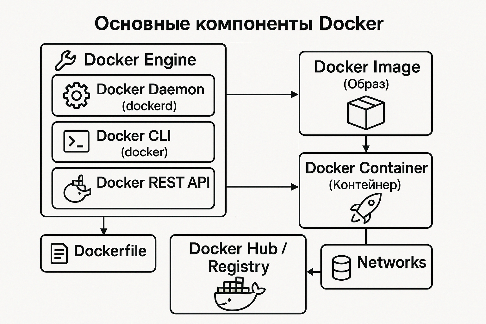

# 🐳 Docker — определение, история, суть и основные компоненты

**Docker* — это платформа с открытым исходным кодом, предназначенная для автоматизации развертывания приложений в контейнерах. 

**Контейнер** — это изолированная среда, которая запускается на уровне операционной системы. Что выгодно отличает контейнер от виртуальных машин, которые эмулируют целую ОС.

## Контейнеризация vs Виртуализация

| Характеристика         | Контейнер (Docker 🐳)                     | Виртуальная машина (VM)                     |
|------------------------|-------------------------------------------|---------------------------------------------|
| Уровень изоляции       | Уровень ОС (ядро общее)                   | Полная ОС с собственным ядром              |
| Объём                  | Легковесный (MB)                          | Тяжелее (GB)                               |
| Скорость запуска       | Почти мгновенно                           | Секунды или минуты                         |
| Зависимости            | Упакованы в контейнер                     | Внутри образа ОС                           |
| Производительность     | Близка к нативной                         | Ниже из-за гипервизора                     |


Docker использует контейнеры, которые разделяют ядро хост-системы, но остаются изолированными в плане процессов, сети и файловой системы.

## Краткая история Docker

- 2010 
  - компания dotCloud (PaaS-провайдер) начинает разработку собственной технологии контейнеров.
- 2013 
  - представлена первая версия Docker на PyCon.
- 2014
  - dotCloud переименовывается в Docker Inc.; 
  - проект Docker быстро становится популярным.
- 2015–2017 
  - начинается стандартизация: создается Open Container Initiative (OCI).
- Сегодня 
  - Docker широко используется в CI/CD, DevOps, микросервисах и облачных платформах.

## Docker позволяет:

- Писать приложения один раз и запускать где угодно, независимо от ОС и окружения.

- Изолировать окружения, облегчая разработку, тестирование и развертывание.

- Упрощать CI/CD, благодаря легковесным и воспроизводимым контейнерам.

- Эффективно использовать ресурсы, в отличие от полноценной виртуализации.

## Основные компоненты Docker

<p align="center">
  
</p>


### 🔧 1. Docker Engine

Главная часть Docker — это движок, включающий:

- **Docker Daemon** (dockerd)
  - Постоянно работающий процесс, управляющий образами, контейнерами, сетями и хранилищем. Принимает команды от клиента.

- **Docker CLI** (docker)
  - Клиентская утилита командной строки, через которую пользователь взаимодействует с демоном. 
  - Все команды (например, docker run, docker build) посылают запросы к демону через API.

- **Docker REST API**
  - Программный интерфейс, позволяющий управлять Docker извне (например, из графических интерфейсов, CI/CD систем и других приложений).

### 📦 2. Docker Image (Образ)

Немодифицируемый (immutable) шаблон, содержащий:

- ОС (обычно минимальную),
- библиотеки,
-  зависимости,
- приложение.

Образы создаются по `Dockerfile` — набору инструкций.


### 🚀 3. Docker Container (Контейнер)

Запущенный экземпляр образа. Он:  
- изолирован (через namespaces и cgroups),
- использует общий движок и ядро хоста,
-  может быть быстро создан, удалён, масштабирован.

### 📄 4. Dockerfile

Файл, описывающий, как собрать образ.
Пример:
```
FROM python:3.11
COPY . /app
WORKDIR /app
RUN pip install -r requirements.txt
CMD ["python", "app.py"]
```

### 🌐 5. Docker Hub / Registry

Облачное хранилище образов (отдалённо и с некоторыми оговорками напоминает `pypo.org`)
По умолчанию используется Docker Hub, но можно подключать собственные registry (например, Harbor, GitHub Packages, GitLab Container Registry).


### 🗃️ 6. Volumes

Механизм для хранения данных вне контейнера. Используются для:  

- сохранения состояния,
- обмена данными между контейнерами,
- монтирования данных с хоста.

### 🔗 7. Networks

Docker создает виртуальные сети для связи между контейнерами. Поддерживает bridge, host и overlay-сети.


## 💡 Заключение

**Docker **— это инструмент, который позволяет:

- изолировать приложения,
- легко их переносить и масштабировать,
- использовать ресурсы эффективнее, чем традиционная виртуализация.