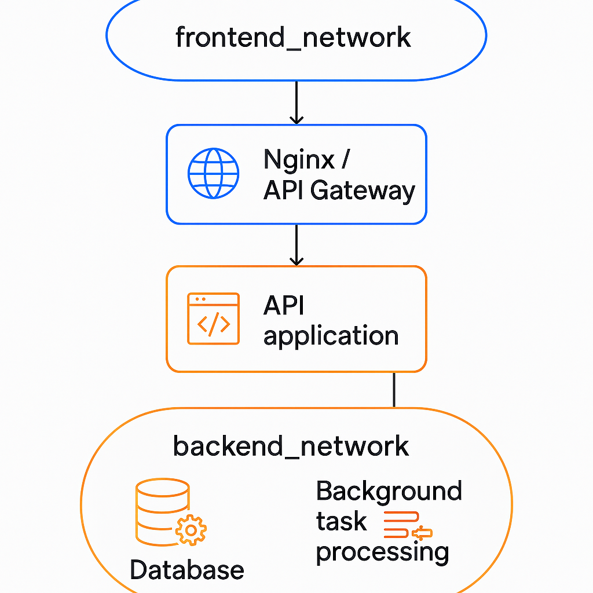

# 🐳 Характеристика сетевого драйвера Docker **Overlay**

## Overlay (Наложенная сеть)

**Overlay сети** - это магистраль, соединяющая контейнеры на разных хост-машинах.   
Они позволяют создавать единое сетевое пространство для всего
кластера Docker, объединяя разрозненные машины в единую систему.

**Описание:**
- **Overlay-сеть** позволяет контейнерам, запущенным **на разных Docker-хостах**, безопасно общаться друг с другом как будто они находятся в одной сети.
- Работает **поверх сетей хостов**: Docker создаёт виртуальную сеть, которая "накладывается" на физические сети.
- Используется в первую очередь в **Docker Swarm** (кластерное управление несколькими хостами).

**Особенности:**
- Требует активированного режима **Swarm** (`docker swarm init`).
- Автоматически шифрует трафик между хостами (опционально).
- Можно использовать для:
  - Внутренней связи сервисов в кластере.
  - Разграничения сетевых сегментов в микросервисной архитектуре.
- Контейнеры на одном и том же хосте в overlay-сети всё равно используют внутреннюю оптимизацию и не гоняют трафик через сеть.

**Как это работает:**
- Docker-демоны обмениваются данными через зашифрованные VXLAN-пакеты.
- Требует настройки сетевой доступности между хостами по нужным портам (например, 2377, 7946, 4789).

**Примеры команд:**

Инициализировать кластер Swarm:

```
docker swarm init
```

Создать Overlay-сеть:

```
docker network create --driver overlay my_overlay_network
```

Создать сервис, подключенный к overlay-сети:

```
docker service create --name my_service --network my_overlay_network nginx
```

Создать контейнеры в overlay-сети (с experimental-функцией в Docker Standalone):

```
docker network create --driver overlay --attachable attachable_overlay
```

Подключение обычных контейнеров к `attachable` overlay-сети:

```
docker run -d --name my_container --network attachable_overlay nginx
```

> **attachable** опция позволяет подключать **обычные контейнеры** (не сервисы) к overlay-сети.

**Просмотр доступных сетей:**

```
docker network ls
```

Инспекция overlay-сети:

```
docker network inspect my_overlay_network
```

---

# 📄 Сравнение Overlay с дефолтными сетями

| Вид сети | Описание | Особенности | Примеры команд |
|:---------|:---------|:------------|:--------------|
| **bridge** | Мостовая сеть между контейнерами и хостом | - Изоляция между контейнерами<br>- Использует NAT<br>- Требуется проброс портов для доступа | `docker network create --driver bridge my_bridge_network`<br>`docker run -d --network my_bridge_network nginx` |
| **host** | Контейнер использует сетевой стек хоста | - Нет отдельного IP<br>- Порты контейнера сразу на хосте<br>- Меньшая изоляция | `docker run -d --network host nginx` |
| **none** | Нет подключения к сети | - Полная изоляция<br>- Нет интернет-доступа<br>- Можно подключить позже | `docker run -d --network none nginx`<br>`docker network connect bridge isolated_container` |
| **overlay** | Виртуальная сеть между контейнерами на разных хостах | - Требуется Docker Swarm<br>- Возможна шифрация трафика<br>- Связь между хостами через виртуальную сеть | `docker swarm init`<br>`docker network create --driver overlay my_overlay_network`<br>`docker service create --name my_service --network my_overlay_network nginx` |


---

# 🛠 Пример использования **нескольких overlay-сетей** для разных групп сервисов в одном Docker Swarm кластере

<p align="center">
  
</p>


📚 Попробуем представить себе сервис реального стартапа:
- Есть Nginx или API Gateway контейнер — он принимает внешние запросы (HTTP).
- Есть API-приложение (например, Flask или Node.js сервер) — обрабатывает бизнес-логику.
- Есть база данных (PostgreSQL, MongoDB) — хранит данные.
- Есть службы обработки фоновых задач — очереди, воркеры.

Требования по уровню доступа:
-  Nginx (API Gateway) должен видеть наружу — его включают в сеть, доступную снаружи (frontend_network).
- API-приложение должно уметь общаться с базой данных — его включают в сеть бэкенда (backend_network).
- Базе данных вовсе не нужно иметь возможность общаться снаружи.
- В то же время некоторые контейнеры, например API-приложение, должны:
  - принимать запросы от фронтенда (имеется в виду Nginx или API Gateway контейнер, а не пользовательский браузер!),
  - и одновременно иметь доступ к базе данных.
  - Поэтому их подключают к обеим сетям.
---

## 🎯 Цель

Разделить разные группы микросервисов (например, фронтенд и бекенд) на **отдельные виртуальные сети** для:
- повышения безопасности,
- упрощения управления доступом между сервисами,
- оптимизации сетевого взаимодействия,
- изоляции потенциальных сбоев (чтобы ошибка в одной группе сервисов не влияла на другие).

---

## 🧠 Обоснование

Почему необходимо использовать **несколько overlay-сетей**:
- **Изоляция**: сервисы фронтенда не имеют прямого доступа к базе данных, если сеть базы данных отдельная.
- **Управляемость**: легче описывать политики сетевого доступа (например, с помощью сервисных сетевых политик или firewall).
- **Производительность**: уменьшение количества broadcast-трафика в сетевых сегментах.
- **Безопасность**: если злоумышленник скомпрометирует один сервис, ему будет сложнее выйти за пределы его сетевого сегмента.

**Возможны альтернативы:**
- Использование **одной общей overlay-сети** и явная настройка файрволов между сервисами (например, с помощью iptables или внешнего прокси).
- Использование **service mesh** решений (например, Istio) для более сложного управления трафиком и политиками между сервисами.
- Использование **Docker network policies** (если поддерживаются), чтобы управлять доступом на уровне одной overlay-сети.

Но **разделение по overlay-сетям** — самый простой и надёжный вариант для средних по сложности систем без дополнительного ПО.

---

## 📚 Пример реализации

1. В кластере Docker Swarm создаются **две overlay-сети**:
   - `frontend_network`
   - `backend_network`

2. Разворачиваются сервисы:
   - Все сервисы, отвечающие за отдачу контента пользователю (например, веб-серверы, API-шлюзы), подключаются **только** к `frontend_network`.
   - Все внутренние сервисы (например, база данных, внутренние API, обработчики платежей) подключаются **только** к `backend_network`.

3. Некоторые сервисы (например, API-шлюз) подключаются одновременно к обеим сетям:
   - К `frontend_network` для приёма внешних запросов.
   - К `backend_network` для общения с внутренними сервисами.

4. Таким образом:
   - Пользовательские запросы приходят к сервису в `frontend_network`.
   - Этот сервис, при необходимости, пересылает запрос во внутреннюю `backend_network`.
   - Прямой доступ пользователя к `backend_network` невозможен.

5. Управление сетями:
   - Каждая сеть создается отдельно с нужными настройками (например, с шифрованием трафика).
   - Сервисы явно указывают, к каким сетям они подключаются.

## 🤔 Почему не оставить всё в одной сети?

Можно, но:
- Не будет чёткой изоляции: любой сервис может обратиться к базе данных напрямую.
- Повышается риск взлома через уязвимости публичных сервисов.
- Труднее управлять правилами доступа и мониторингом.
- Нет возможности в будущем легко добавить правила безопасности между сетями.

## Таким образом:

| Компонент          | Сети                           | Тип доступа      | Причина                                                           |
|:-------------------|:-------------------------------|:-----------------|:------------------------------------------------------------------|
| Nginx / API Gateway | frontend_network               | 🌐 Внешний         | Принимает внешние запросы                                          |
| API-приложение      | frontend_network + backend_network | 🌐🔒 Внешний и внутренний | Получает запросы от Nginx и обращается к базе данных              |
| База данных         | backend_network                | 🔒 Внутренний      | Доступ только для внутренних сервисов, никакого доступа снаружи   |

